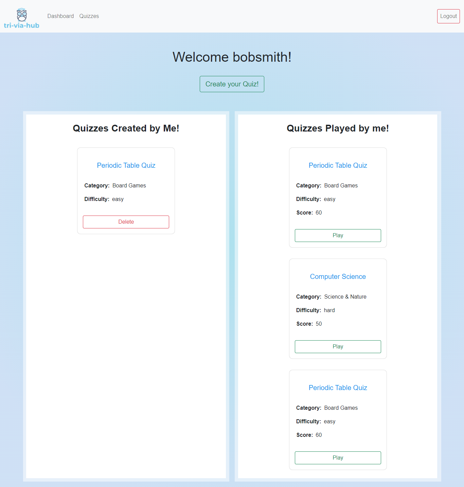
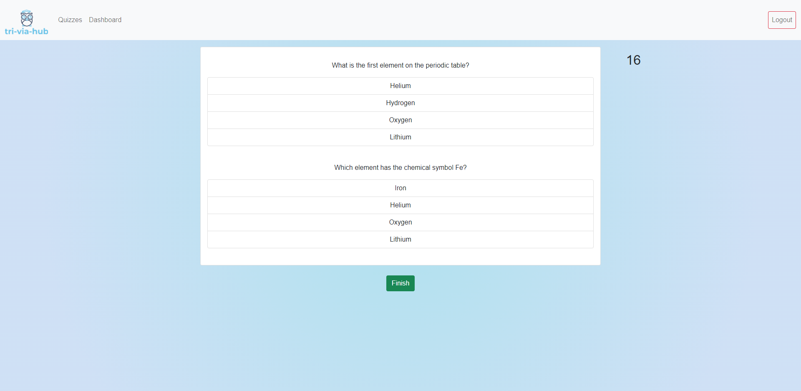
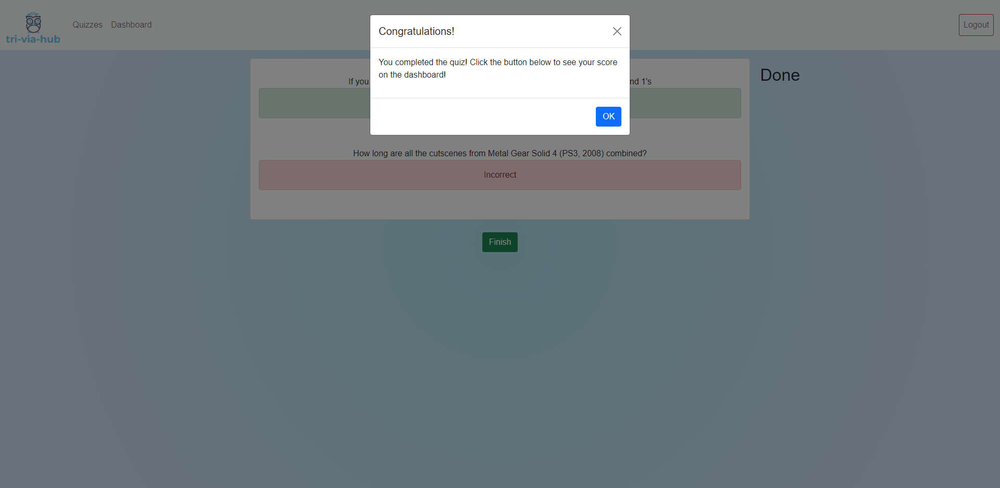
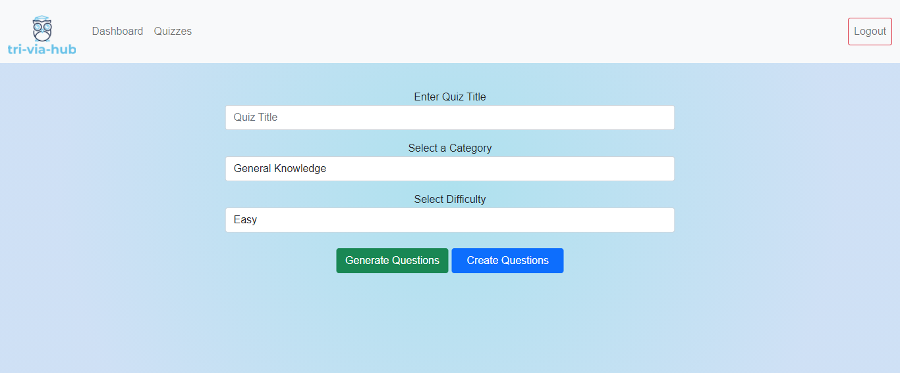

# Tri-via-hub

You wanna play something interesting? Visit Tri-via-hub website and you could enjoy multiple quizzes at once. Tri-via-hub website is a single platform on which you could play quizzes and create quizzes related to nature, history, sports, science, geography etc.

## Deployed Github Page

Click [Heroku](https://powerful-journey-42110.herokuapp.com/) to view project.

**Contributors**

Vilma: [Github](https://github.com/vilmaq)

Nazim: [Github](https://github.com/MRasheed1991)

Nazia: [Github](https://github.com/Nrasool21)

Soumeya Hassan: [Github](https://github.com/SoumeyaH)

Leon: [Github](https://github.com/Leon3005)

Eti Priya: [Github](https://github.com/Etipriya)

## How do I use Tri-via-hub?

A user should be able to visit the site and on the homepage they will be presented with some quiz categories (with images). Once they click on a category it will take them to the page for that category where they can view the quizzes for that category.

If the user isn't logged in, the navbar on the homepage should have links for Home,Login, and Sign Up.

Once they click on any Quiz, it will redirect them to log in.

If the user is logged in, the navbar will also have

- A Dashboard to view their personal profile
- Quizzes - to move upto the quizzes page
- Instead of Sign Up/Log in, it will have a log out.

The Dashboard will have a list of quizzes that the user has completed or added to their list and they will be able see their scores for the quizzes or delete the quizzes they have created.

Dashboard will be having two section's.

- One for the quizzes that they have created. They could delete the quiz by clicking on the "Delete" button below.
- Other, for the quizzes that they have completed with their score and the could play them again by clicking on "Play" button.

If user clicks on the quizzes in the navbar, he will be able to see the quizzes. Then if they click on "Play"button. They will be taken to the questions in that quiz.

The quiz page should show most recent quizzes, a search bar, an option to play. If you click on "Play", it will take you to the questions on the next page.

Once the user has completed the quiz, they will see their score on the dashboard.

The "create a quiz page" has the title, category and difficulty.If the user needs to generate some questions using the API, they could click on "Generate Questions". Else, they could click on "Create questions".

## Technology/Framework used

- Workbench
- Postman
- Bootstrap
- JQuery
- API - open Trivia DB

## Features

- Tri-via-hub helps to increase the knowledge of any age group.
- It helps in development of brain as it has quizzes related to any age group.
- Just sign-up and login and you could view multiple quizzes related to nature, science and geography etc. so it's easily accessible.

## Project Documentation

- Tri-via-hub is an interesting and involving website.
- It brings people together by increasing the knowledge towards various fields.
- It gives an exposure to every individual and of any age.

## Objectives

- Interesting quizzes with timer and score.
- Allow user to save their quizzes for future.
- Enhance user experience by multiple question in quizzes.

## Getting started

We started with the project with the following steps:

- npm run i
- npm run seed
- npm run start/ npm run dev

## Project Charter

Tri-via-hub is an interesting and involving website. It brings people together by increasing the knowledge towards various fields. It gives an exposure to every individual and of any age.

**Key requirement** - tasks, roles and responsibilities were allotted at the starting of the project.

**We used:**

Wire frames - Draw IO
Frontend - HTML, CSS, JavaScript
Backend - Jquery

## User Journey

**Make a search** - User could use this website easily on his mobile, tablet or computer and play a quiz according to their interest.

**Create Quizzes** - User could move to the dashboard and create quizzes by either using the API or by writing the questions.

**Playing Quizzes** - User could click on the play button and he will be moved to the question's page where he could see the timer for the quiz.

**Remove created quiz** - User could easily remove a quiz by clicking on "Delete" button.

## Project Retrospective

- Tri-via-hub is a wonderful platform which helps people learn more.
- It is an interactive app which increases the knowledge and creates interest in various fields.
- It depends on the interests and various activities which everyone used to do.-

## Improvements to be made

This project could be improved by adding

- Rating of every quiz
- Connect with other users.
- API accessibility

**Lessons learnt**

We learned about various things:

- Related to API - We looked into influence of an API on the project.
- Stringify the answers in database as they were stored in an array.
- Some features had to be cut due to time frame.

**Timeline**
Every task was given a limited time and whole team has been into the project. So, everyone completed the task and helped each other in a great manner.

## Results

**Objectives were achieved as below:**

- Our website instantly grabs user towards various quizzes related to various streams.

- It adds the cards to dashboard page after completing the quiz.

- It removes a quiz easily from dashboard page by clicking on "Delete" button easily.

- It shows created quiz and played quizzes on the same page.

- It easily comes back to the home page.

- It easily allows to sign up and logout.
